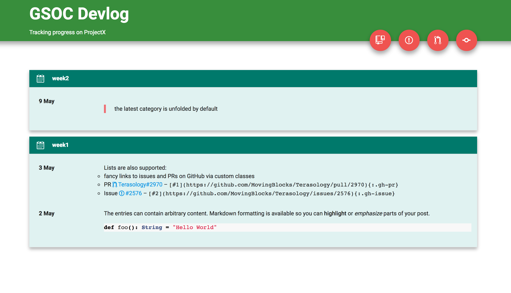

# Devlog Template

This is a template for a **Devlog** blog based on Jekyll.
It can easily be deployed via GitHub to show of continuous development work,
e.g., during the [Google Summer of Code](https://summerofcode.withgoogle.com/) project.

This template is not our work but is based on [Karan's devlog](http://karandesai-96.github.io/devlog/)
([source :octocat:](https://github.com/karandesai-96/devlog)) with modifications
by [Mikhail](https://github.com/mishinma/carsusdevlog).
The source code was cleaned from content and enriched with some comments to help
people get set up.

The design of the devlog page uses [Material Design](https://material.io/guidelines/material-design/introduction.html#introduction-principles) with [Roboto](https://fonts.google.com/specimen/Roboto) font.

## Setup and Configuration

To set up your personal devlog you just have to clone this repository and fill
it with content.
Read more about using Jekyll with GitHub page [on GitHub](https://help.github.com/articles/using-jekyll-as-a-static-site-generator-with-github-pages/)
and/or [Jekyll](https://jekyllrb.com/docs/github-pages/).

You should change your personal information and links to your project in
`_config.yml`. The site title and description is also adjustable in this file.

## Tracking Progress

The devlog will show _progress entries_ grouped by _categories_.
Each entry is prefixed with its posting date and can hold arbitrary content in
Markdown format.



To start blogging, just create a file for each entry in `_posts`. The filename
should start with the date, e.g., `2017-07-01-first_entry.md`.
The [Front Matter](https://jekyllrb.com/docs/frontmatter/) holds information on the category and date.

```markdown
---
date: 2017-07-01
category: week1
---

< .. content .. >
```

---
### Contributing

Contributions to this template are always welcome. Please open a pull request
(PR) for adding new features or fixing bugs.
If you want to report a problem please use the issue tracker on GitHub.

---

### Credits

This template was not made from scratch. We would like to give special credit to:

- [Karan Desai :octocat:](https://github.com/karandesai-96) - initial template
- [Mikhail Mishin :octocat:](https://github.com/mishinma) - modified template
